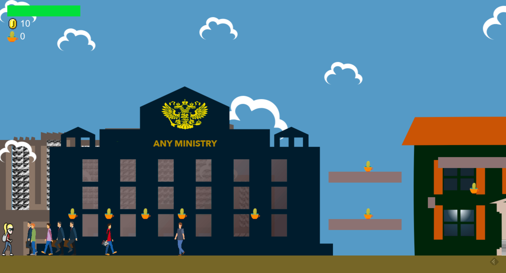

# Cactus Game

Survive in the playing field and try to keep both the character's happy and enough money while cops try to illegally arrested you. 

[**Play the game**](https://pulpiks.github.io/coins/dist/)

 
## How to play

Your goal is to survive and reach the end, trying to save resources.
 It can be achieved by both:

* increasing the number of cactuses
* improving the mood of person 

1. The game is over when either person's mood reaches zero(the spripe gets blinking red tint) or he is out of money. Mind the progress bar in the top left corner.
2. Person's mood **decreases** gradually byt colliding clerks. **Cheer his up** by colliding with kind passers(not clerks, not policemen). 

### Enemies

1. **Cops** will be run into you on your way.  If they catch you, you loose and becoming disabled(cooldown) for a few sec. You can jump over them if you have enough velocity and good position.
2. **Clerks** will take your mood. Each clerk is unique and is able to take mood once. 

### Good characters

1. **Squad from passers**, looks like people in colorful skins. There are passer with poster with picture of Sentsov, pupils, etc. They collide the main person and donate money to your mission. If you collide more then N passers you will get additional cash awards.

 
### Tips

* try to pick up left cactuses and thrown them accurately 
* try to stay on obstacles while cops are close to you and touch you 
 
## Controls
### Keyboard

`Arrows` — move around  
`Up` - press twice to jump higher
`A` — throw cactus  

## Credits

#### Textures, graphics:
 
[flaticon.com](https://www.flaticon.com/)

#### Game engine:

[Phaser.js](http://phaser.io)
